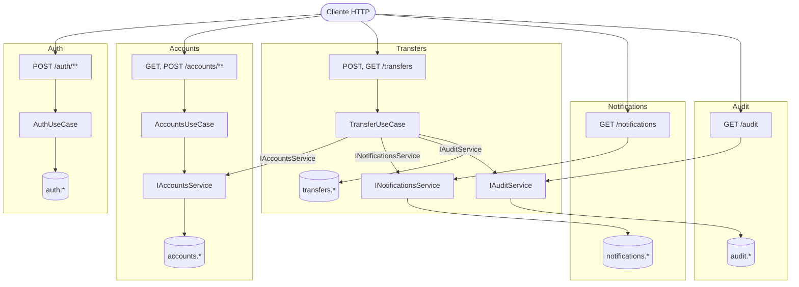
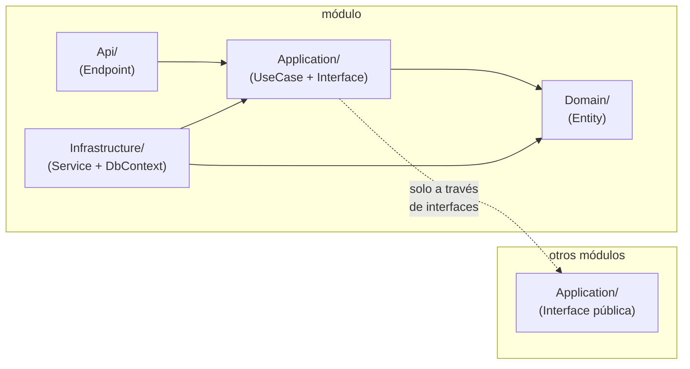
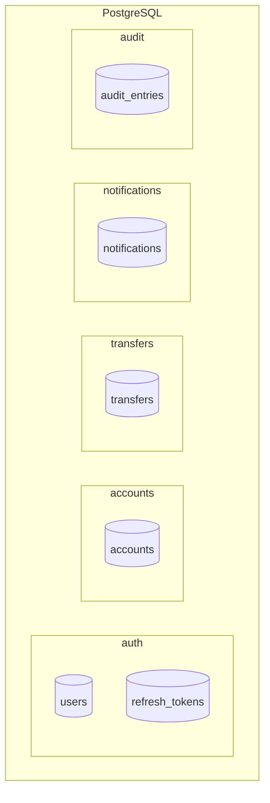

# modular-bank-dotnet

Monolito modular bancario implementado en .NET 10 / ASP.NET Core. Referencia técnica paralela a `modular-bank-java`.

## Requisitos
- .NET 10 SDK
- Docker

## Ejecutar

```bash
docker-compose up -d
dotnet run --project src/ModularBank/
```

Las migraciones de EF Core se aplican automáticamente al iniciar la aplicación.

## Módulos

| Módulo | Schema | Interfaz pública |
|---|---|---|
| Auth | auth.* | — (solo JWT) |
| Accounts | accounts.* | IAccountsService |
| Transfers | transfers.* | — (orchestrador) |
| Notifications | notifications.* | INotificationsService |
| Audit | audit.* | IAuditService |

## Arquitectura

### Dependencias entre módulos



### Capas internas de cada módulo



### Aislamiento de schemas en PostgreSQL


